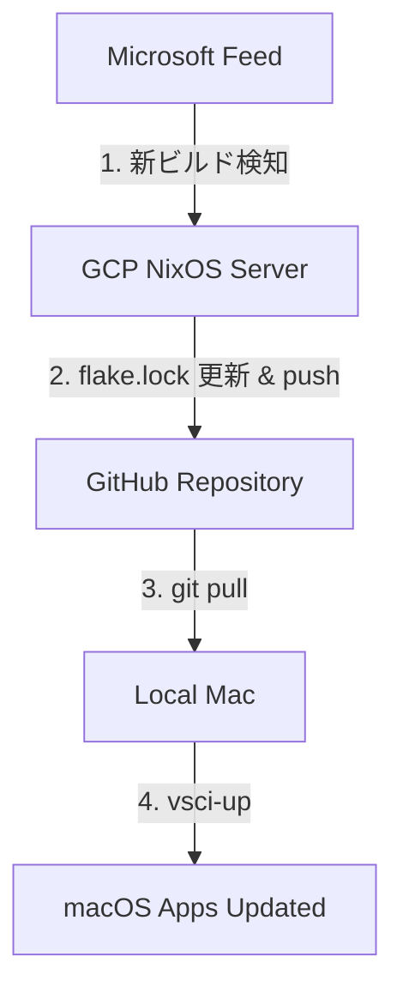

# dotfiles

Nix flake で管理する、macOS と NixOS サーバの統合環境。
「サーバが最新版を検知して GitHub を更新し、Mac がそれを受け取る」という自律的なサイクルを核としています。

---

## 原則 (Principles)

- **クロスプラットフォーム第一** — macOS / Linux、arm64 / x86_64 を想定して設計する。
- **ハードコーディング禁止** — URL やハッシュは `inputs` 等で管理し、コードに直接埋め込まない。
- **フレーク中心** — 外部バイナリ情報は `flake.lock` でハッシュを固定し、再現性を担保する。
- **純粋な Nix 評価** — 可能な限り純粋な評価で完結させ、秘密情報以外で外部スクリプトを必須にしない。
- **モジュール化** — 設定は `modules/` に分割し、ホスト間でポータブルに保つ。

---

## サイクル図 (VS Code Insiders 更新フロー)



---

## ホスト構成

| ホスト名 | 種類 | 役割 | 適用コマンド |
|---|---|---|---|
| `yuta` | nix-darwin | メイン作業環境 (Apple Silicon) | `sudo darwin-rebuild switch --flake .#yuta` |
| `server` | NixOS | 24/7 自動化基盤 (GCP x86_64) | `nixos-rebuild switch --flake .#server --target-host root@dotfiles-bot` |

---

## 主要な仕組み

### 1. macOS: 統合管理と Spotlight 連携
- **nix-darwin**: システム設定と GUI アプリ (`/Applications/Nix Apps`) を管理。
- **Home Manager**: ユーザ個別の設定（zsh, git 等）を管理。
- **mkalias**: Nix で入れたアプリを Spotlight で検索可能にする自動エイリアス機能。

### 2. Server: インフラのコード化
- **Disko**: ディスクパーティションを Nix で宣言的に定義。
- **nixos-anywhere**: 外部ツールなしで、Mac からコマンド一発でサーバを構築。

### 3. Automation: 自律的な環境維持
- **GCP Secret Manager**: GitHub トークンをセキュアに保持し、サーバが GitHub へ push するのを許可。
- **Systemd Timer**: 毎日 12:00 (JST) に VS Code の更新を確認。

---

## 日常の運用

このプロジェクトの「原則」に基づき、運用は以下の 2 つのパスを使い分けます。

### A. 通常の同期パス (推奨 / サーバ主導)
サーバが毎日お昼に `flake.lock` を更新しているため、基本はこの「設計図」を受け取るだけです。
```bash
# 1. GitHub からサーバが更新した最新ハッシュを受け取る
git pull

# 2. 手元の環境に適用する (darwin ならエイリアス等も更新)
sudo darwin-rebuild switch --flake .#yuta
```

### B. 即時アップデートパス (手動ブースト)
サーバの自動更新を待てず、**「今すぐ」**出たばかりの最新ビルドを試したい場合のみ使用します。
```bash
# 修正済みのヘルパースクリプトを実行 (内部で git pull -> update -> switch を完結)
vsci-up
```

---

## 構成の詳細は各ドキュメントを参照
- [**deploy/README.md**](deploy/README.md): サーバの初回構築・インフラ・Secret Manager の管理手順
- [**modules/**](modules/): 各種設定モジュール（home-manager, nix-darwin, nixos）