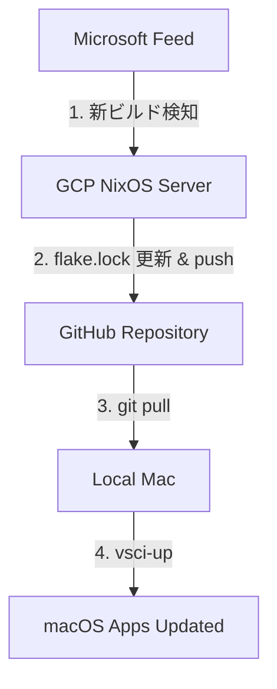

# dotfiles

Nix flake で管理する、macOS と NixOS サーバの統合環境。
「サーバが最新版を検知して GitHub を更新し、Mac がそれを受け取る」という自律的なサイクルを核としています。

---

## 原則 (Principles)

- **クロスプラットフォーム第一** — macOS / Linux、arm64 / x86_64 を想定して設計する。
- **ハードコーディング禁止** — URL やハッシュは `inputs` 等で管理し、コードに直接埋め込まない。
- **フレーク中心** — 外部バイナリ情報は `flake.lock` でハッシュを固定し、再現性を担保する。
- **純粋な Nix 評価** — 可能な限り純粋な評価で完結させ、秘密情報以外で外部スクリプトを必須にしない。
- **樹状構造 (Dendritic)** — 設定は `hosts → profiles → modules` の順に委譲し、ホスト間でポータブルに保つ。
- **`~/dev/` 規約** — ローカル開発作業のルートを `~/dev/` に固定する（例外的な許容ハードコード）。dotfiles 本体は `~/dev/dotfiles/`、個人スキルは `~/dev/my-skills/` に置く。

---

## サイクル図 (VS Code Insiders 更新フロー)


```mermaid
graph TD
    A[Microsoft Feed] -->|1. 新ビルド検知| B[GCP NixOS Server]
    B -->|2. flake.lock 更新 & push| C[GitHub Repository]
    C -->|3. git pull | D[Local Mac]
    D -->|4. vsci-up| E[macOS Apps Updated]
```

---

## ホスト構成

| 名前 | 種類 | 役割 | 適用コマンド |
|---|---|---|---|
| `yuta` | nix-darwin | メイン作業環境 (Apple Silicon) | `sudo darwin-rebuild switch --flake .#yuta` |
| `server` | NixOS | 24/7 自動化基盤 (GCP x86_64) | `nixos-rebuild switch --flake .#server --target-host root@dotfiles-bot` |
| `box-ai` | NixOS (OrbStack VM) | AI coding agents の隔離環境 | `sudo nixos-rebuild switch --flake .#box-ai`（VM内で実行） |

---

## ディレクトリ構造

```
dotfiles/
├── flake.nix                        # inputs / outputs の定義
├── hosts/                           # 物理機・クラウド VM
│   ├── darwin/default.nix           # マシン固有ファクト (platform, primaryUser, stateVersion)
│   └── server/default.nix           # NixOS サーバ固有ファクト
├── boxes/                           # OrbStack VM として起動する隔離環境
│   └── box-ai/default.nix           # AI coding agent CLIs 専用環境
├── profiles/
│   └── darwin.nix                   # darwin 環境の全設定を集約（enable フラグ + 常時ON設定）
└── modules/
    ├── common/                      # OS 非依存ツール（nix-darwin システムモジュールとして実装）
    │   ├── primary-user.nix         # myConfig.primaryUser オプション定義
    │   ├── cli-tools.nix
    │   ├── zsh.nix
    │   ├── git.nix
    │   ├── go.nix / python.nix / rust.nix / node.nix / terraform.nix
    │   ├── vscode.nix
    │   ├── claude-code.nix / gemini-cli.nix / copilot-cli.nix
    │   ├── gcloud.nix
    │   └── antigravity.nix
    ├── darwin/                      # macOS 専用アプリ・ツール（Homebrew Cask 中心）
    │   ├── homebrew.nix             # Homebrew 基盤（他 darwin モジュールが import する）
    │   ├── orbstack.nix             # OrbStack VM ランタイム
    │   ├── borders.nix / raycast.nix / ice.nix / alt-tab.nix
    │   ├── discord.nix / spotify.nix / obsidian.nix / dia.nix
    │   ├── google-calendar.nix
    │   ├── aerospace/               # AeroSpace ウィンドウマネージャ
    │   ├── karabiner/               # Karabiner-Elements キーリマップ
    │   ├── linearmouse/             # LinearMouse マウス設定
    │   └── pake-webapps/            # Pake webapp ビルドマネージャ
    └── nixos/
        ├── orbstack-vm.nix          # OrbStack VM 共通ハードウェア設定（bootloader なし、btrfs）
        ├── box-base.nix             # 全 box 共通の VM ホスト定型
        └── flake-autoupdate.nix     # サーバ自動更新 systemd サービス
```

---

## 主要な仕組み

### 1. macOS: 統合管理と Spotlight 連携

- **nix-darwin**: システム設定と GUI アプリ (`/Applications/Nix Apps`) を管理。
- **Home Manager**: ユーザ個別の設定（zsh, git 等）を管理。common モジュールが内部で `home-manager.users.*` を呼び出すため、consumers は HM レイヤを意識しない。
- **mkalias**: Nix で入れたアプリを Spotlight で検索可能にする自動エイリアス機能。

### 2. Server: インフラのコード化

- **Disko**: ディスクパーティションを Nix で宣言的に定義。
- **nixos-anywhere**: 外部ツールなしで、Mac からコマンド一発でサーバを構築。

### 3. Automation: 自律的な環境維持

- **GCP Secret Manager**: GitHub トークンをセキュアに保持し、サーバが GitHub へ push するのを許可。
- **Systemd Timer**: 毎日 12:00 (JST) に VS Code の更新を確認。

---

## 日常の運用

### A. 通常の同期パス (推奨 / サーバ主導)

```bash
# 1. GitHub からサーバが更新した最新ハッシュを受け取る
git pull

# 2. 手元の環境に適用する
sudo darwin-rebuild switch --flake .#yuta
```

### B. 即時アップデートパス (手動ブースト)

```bash
# git pull -> flake update -> darwin-rebuild switch を一括実行
vsci-up
```

---

## Boxes — 隔離された作業環境

### 背景と動機

一言で言うと：**「Docker的な体験」を「Nixエコシステムそのまま」で実現する**。

Docker のように用途ごとに環境を切り、使い捨て・再作成できる体験がほしい。ただし、すでに darwin / server で育てた nixpkgs のパッケージ・flake.lock による再現性・Nix の宣言的な書き方をそのまま使いたい。Dockerfile という別のエコシステムを持ち込みたくない。

この思想のもとで boxes パターンが生まれた。

**普通の VM との違い**：VM は環境とデータが一体で、消すと全てを失い、再現には手順書が必要になる。boxes は「環境の定義（Nix）」と「作業データ（`/data/boxes/*/`）」を意図的に分離する。VM を作り直しても定義は git に残り、データは永続する。

**Docker との違い**：技術的な差より思想の差。Docker は「アプリを動かすコンテナ」、boxes は「人間が入って作業する環境」。そして darwin / server / boxes が全て同じ Nix で統一されるため、別のエコシステムを覚えなくていい。すでに Nix を育てている人にとっての最適解。

### アーキテクチャ（3 層）

```
macOS
  └── OrbStack VM (NixOS)              boxes/box-NAME/default.nix
        ├── /data/boxes/NAME/          永続ストレージ（VM 再起動でも消えない）
        └── nixos-container NAME       隔離された作業空間
              └── /root/               /data/boxes/NAME/ をマウント
                    claude, gemini...  ここにいる
```

| レイヤ | 技術 | 役割 |
|---|---|---|
| macOS | nix-darwin | OrbStack アプリを動かす土台 |
| OrbStack VM | NixOS (`box-base.nix`) | Linux カーネル・永続ストレージの提供 |
| nixos-container | systemd-nspawn | ファイルシステム隔離。`/root/` 以外は見えない |

OrbStack は macOS のファイルシステムを VM 内にマウントするため (`/Users/yuta/` が VM 内でも見える)、dotfiles の編集は mac 上で行い、VM 内で `nixos-rebuild switch` をそのまま呼べる。ただしコンテナ内からは macOS のファイルは見えない（隔離されている）。

### ファイル空間の対応

| 視点 | パス |
|---|---|
| macOS | `/Users/yuta/OrbStack/box-ai/data/boxes/ai/` |
| OrbStack VM | `/data/boxes/ai/` |
| コンテナ内（作業場所） | `/root/` |

コンテナを停止・VM を再起動してもデータは `/data/boxes/*/` に残る。

### 構成

```
boxes/
  box-ai/default.nix    # 固有部分のみ記述（定型は box-base.nix に委譲）
modules/nixos/
  orbstack-vm.nix       # OrbStack ハードウェア設定（全 box 共通）
  box-base.nix          # VM ホスト定型（ユーザー・sudo・nix 設定等）
modules/darwin/
  box.nix               # macOS の box コマンド
```

各 box の `default.nix` は固有部分（コンテナ定義・ツール）のみを記述し、VM ホストの定型は `box-base.nix` が担う。

### セットアップ手順（初回）

```bash
# 1. darwin に box コマンドを適用（初回のみ）
sudo darwin-rebuild switch --flake .#yuta

# 2. OrbStack で VM を作成し設定を適用
orb create nixos:24.11 box-ai
ssh root@box-ai.orb.local "nixos-rebuild switch --flake /Users/yuta/dev/dotfiles#box-ai"
```

### 日常操作

macOS から `box` コマンドだけで操作できる（OrbStack・nixos-container を意識しない）:

```bash
box ai            # → [box-ai] ~ # に入る
box switch ai     # → 環境を再定義して適用（darwin-rebuild switch と同じ感覚）
box stop ai       # → コンテナを停止（データは保持）
```

OrbStack の「起動時に実行」を有効にすれば、mac 起動 → VM 自動起動 → コンテナ自動起動 → `box ai` 一発でシェルに入れる。

### 新しい box を追加する

`boxes/box-NAME/default.nix` を作成し `flake.nix` に追記するだけ。
詳細パターンは [AGENTS.md](AGENTS.md) の `boxes/` セクションを参照。

---

## 構成の詳細は各ドキュメントを参照

- [**deploy/README.md**](deploy/README.md): サーバの初回構築・インフラ・Secret Manager の管理手順
- [**modules/darwin/aerospace/README.md**](modules/darwin/aerospace/README.md): AeroSpace の利用マニュアル
- [**AGENTS.md**](AGENTS.md): モジュール追加・変更時のパターンガイド（AI エージェント向け）
