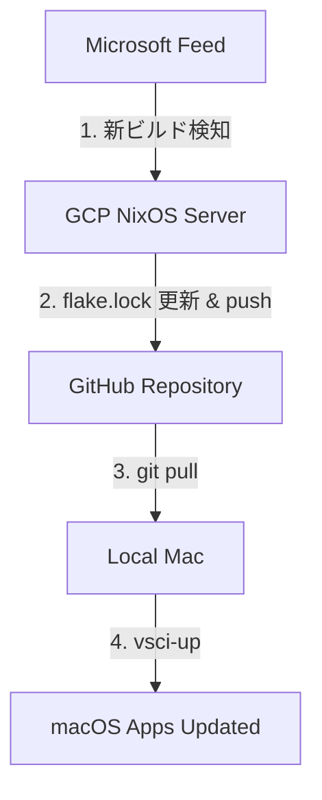

# dotfiles

Nix flake で管理する、macOS と NixOS サーバの統合環境。
「サーバが最新版を検知して GitHub を更新し、Mac がそれを受け取る」という自律的なサイクルを核としています。

---

## 原則 (Principles)

- **クロスプラットフォーム第一** — macOS / Linux、arm64 / x86_64 を想定して設計する。
- **ハードコーディング禁止** — URL やハッシュは `inputs` 等で管理し、コードに直接埋め込まない。
- **フレーク中心** — 外部バイナリ情報は `flake.lock` でハッシュを固定し、再現性を担保する。
- **純粋な Nix 評価** — 可能な限り純粋な評価で完結させ、秘密情報以外で外部スクリプトを必須にしない。
- **樹状構造 (Dendritic)** — 設定は `hosts → profiles → modules` の順に委譲し、ホスト間でポータブルに保つ。

---

## サイクル図 (VS Code Insiders 更新フロー)


```mermaid
graph TD
    A[Microsoft Feed] -->|1. 新ビルド検知| B[GCP NixOS Server]
    B -->|2. flake.lock 更新 & push| C[GitHub Repository]
    C -->|3. git pull | D[Local Mac]
    D -->|4. vsci-up| E[macOS Apps Updated]
```

---

## ホスト構成

| ホスト名 | 種類 | 役割 | 適用コマンド |
|---|---|---|---|
| `yuta` | nix-darwin | メイン作業環境 (Apple Silicon) | `sudo darwin-rebuild switch --flake .#yuta` |
| `server` | NixOS | 24/7 自動化基盤 (GCP x86_64) | `nixos-rebuild switch --flake .#server --target-host root@dotfiles-bot` |

---

## ディレクトリ構造

```
dotfiles/
├── flake.nix                        # inputs / outputs の定義
├── hosts/
│   ├── darwin/default.nix           # マシン固有ファクト (platform, primaryUser, stateVersion)
│   └── server/default.nix           # NixOS サーバ固有ファクト
├── profiles/
│   └── darwin.nix                   # darwin 環境の全設定を集約（enable フラグ + 常時ON設定）
└── modules/
    ├── common/                      # OS 非依存ツール（nix-darwin システムモジュールとして実装）
    │   ├── cli-tools.nix
    │   ├── zsh.nix
    │   ├── git.nix
    │   ├── go.nix / python.nix / rust.nix / node.nix / terraform.nix
    │   ├── vscode.nix
    │   ├── claude-code.nix
    │   ├── gcloud.nix
    │   └── antigravity.nix
    ├── darwin/                      # macOS 専用アプリ・ツール（Homebrew Cask 中心）
    │   ├── homebrew.nix             # Homebrew 基盤（他 darwin モジュールが import する）
    │   ├── borders.nix / raycast.nix / ice.nix / alt-tab.nix
    │   ├── discord.nix / spotify.nix / obsidian.nix / dia.nix
    │   ├── google-calendar.nix
    │   ├── aerospace/               # AeroSpace ウィンドウマネージャ
    │   ├── karabiner/               # Karabiner-Elements キーリマップ
    │   ├── linearmouse/             # LinearMouse マウス設定
    │   └── pake-webapps/            # Pake webapp ビルドマネージャ
    └── nixos/
        └── flake-autoupdate.nix     # サーバ自動更新 systemd サービス
```

---

## 主要な仕組み

### 1. macOS: 統合管理と Spotlight 連携

- **nix-darwin**: システム設定と GUI アプリ (`/Applications/Nix Apps`) を管理。
- **Home Manager**: ユーザ個別の設定（zsh, git 等）を管理。common モジュールが内部で `home-manager.users.*` を呼び出すため、consumers は HM レイヤを意識しない。
- **mkalias**: Nix で入れたアプリを Spotlight で検索可能にする自動エイリアス機能。

### 2. Server: インフラのコード化

- **Disko**: ディスクパーティションを Nix で宣言的に定義。
- **nixos-anywhere**: 外部ツールなしで、Mac からコマンド一発でサーバを構築。

### 3. Automation: 自律的な環境維持

- **GCP Secret Manager**: GitHub トークンをセキュアに保持し、サーバが GitHub へ push するのを許可。
- **Systemd Timer**: 毎日 12:00 (JST) に VS Code の更新を確認。

---

## 日常の運用

### A. 通常の同期パス (推奨 / サーバ主導)

```bash
# 1. GitHub からサーバが更新した最新ハッシュを受け取る
git pull

# 2. 手元の環境に適用する
sudo darwin-rebuild switch --flake .#yuta
```

### B. 即時アップデートパス (手動ブースト)

```bash
# git pull -> flake update -> darwin-rebuild switch を一括実行
vsci-up
```

---

## 構成の詳細は各ドキュメントを参照

- [**deploy/README.md**](deploy/README.md): サーバの初回構築・インフラ・Secret Manager の管理手順
- [**modules/darwin/aerospace/README.md**](modules/darwin/aerospace/README.md): AeroSpace の利用マニュアル
- [**AGENTS.md**](AGENTS.md): モジュール追加・変更時のパターンガイド（AI エージェント向け）
